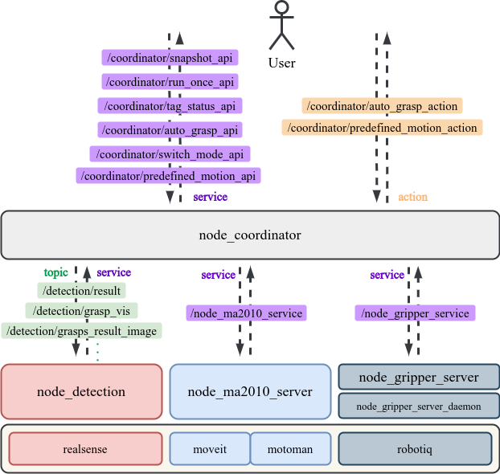
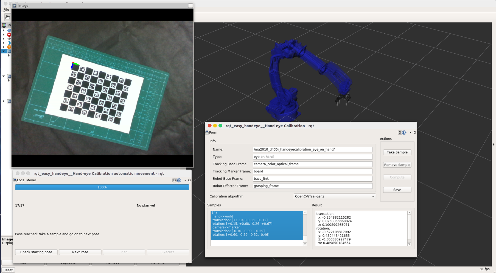

# 安川MA2010机械臂 + Robotiq 2F-140 + RealSense 视觉抓取

**功能：在ROS平台上，使用realsense相机引导安川MA2010机械臂用Robotiq 2F-140夹爪进行抓取**

- [安川MA2010机械臂 + Robotiq 2F-140 + RealSense 视觉抓取](#安川ma2010机械臂--robotiq-2f-140--realsense-视觉抓取)
  - [0. 操作注意事项](#0-操作注意事项)
  - [1. 前提条件](#1-前提条件)
    - [1.1. 软件条件](#11-软件条件)
    - [1.2. 硬件条件](#12-硬件条件)
  - [2. 软件安装](#2-软件安装)
    - [2.1. 前置软件条件](#21-前置软件条件)
    - [2.2. 硬件驱动](#22-硬件驱动)
    - [2.3. 安装本仓库](#23-安装本仓库)
  - [3. 安川驱动测试](#3-安川驱动测试)
    - [3.1. 官方的功能包测试](#31-官方的功能包测试)
    - [3.2. 用带有robotiq夹爪的机械臂测试](#32-用带有robotiq夹爪的机械臂测试)
  - [4. 各节点功能介绍](#4-各节点功能介绍)
    - [4.1. Robotiq夹爪功能](#41-robotiq夹爪功能)
    - [4.2. MA2010 Server功能](#42-ma2010-server功能)
    - [4.3. Coordinator功能](#43-coordinator功能)
      - [4.3.1. debug模式](#431-debug模式)
        - [4.3.1.1. 执行一次抓取](#4311-执行一次抓取)
        - [4.3.1.2. 控制机械臂只前往目标抓取点而不执行抓取操作](#4312-控制机械臂只前往目标抓取点而不执行抓取操作)
        - [4.3.1.3. 获取抓取位姿的快照](#4313-获取抓取位姿的快照)
      - [4.3.2. auto模式](#432-auto模式)
        - [4.3.2.1. 自动抓取](#4321-自动抓取)
          - [开始自动抓取](#开始自动抓取)
          - [停止自动抓取](#停止自动抓取)
        - [4.3.2.2. 预定义动作](#4322-预定义动作)
      - [4.3.3. 状态记录](#433-状态记录)
    - [4.4. 检测功能](#44-检测功能)
        - [启动检测节点](#启动检测节点)
  - [5. 眼在手上标定](#5-眼在手上标定)
  - [致谢/参考资料](#致谢参考资料)


---


## 0. 操作注意事项

本仓库实现的所有系统功能仅为实验性质，并未考虑机械臂运动的安全性问题，因此操作的时候必须十分注意机械臂的动作情况，以免与人或物发生碰撞。

**因此建议操作过程中要护住示教器上的急停按钮，以免发生意外。**


## 1. 前提条件

### 1.1. 软件条件

系统：Ubuntu16.04 + ROS kinetic

语言：Python3.7 + CPP

### 1.2. 硬件条件

机械臂：安川MA2010机械臂

相机：Intel RealSense D435i

二指夹持器：Robotiq 2F-140

其它：双绞线、USB线、万用表等


## 2. 软件安装

### 2.1. 前置软件条件

1. 安装[ROS](https://wiki.ros.org/kinetic/Installation/Ubuntu)

   ```bash
   # 包括ros-controller
   sudo apt-get install ros-kinetic-ros-control
   sudo apt-get install ros-kinetic-ros-controllers
   sudo apt-get install ros-kinetic-moveit
   ```
2. 安装[realsense-ros](https://github.com/IntelRealSense/realsense-ros)（使用的是ROS1）

   * realsense2_camera（相机发布图像话题）
   * realsense2-description（包含相机urdf模型）

### 2.2. 硬件驱动

* 安川机械臂机械臂驱动使用[ros-industrial/motoman](https://github.com/ros-industrial/motoman)，本仓库删除了一些无关的内容，仅保留ma2010_support；
  * 机械臂的下位程序需提前下载到控制柜，参考[官方文档](http://wiki.ros.org/motoman)。

* Robotiq 2F-140使用[Danfoa/robotiq_2finger_grippers](https://github.com/Danfoa/robotiq_2finger_grippers)的代码进行驱动，对某些部分进行修改并集成在本仓库中。

### 2.3. 安装本仓库

1. 创建工作空间
   ```bash
   mkdir demo_ws
   ```
2. 将项目clone下来并初始化工作空间
   ```bash
   cd demo_ws
   git clone --recursive https://github.com/ryanreadbooks/motoman_robotiq_grasping.git src
   cd src && catkin_init_workspace
   ```
3. 相关依赖的安装
   ```bash
   cd ..
   rosdep install --from-paths src --ignore-src -y -r
   ```
4. 使用catkin build编译
   ```bash
   # 由于项目使用python3,所以需要指定python3路径进行编译，向下面这样，如果你是其它路径，则替换下面三个路径
   # /path/to/your路径一般来说是你的python3安装路径
   # 分别在bin、include、lib三个子目录中，找到python、python3.Xm、libpython3.Xm.so三个文件 （3.X为python的版本）
   catkin config -DPYTHON_EXECUTABLE=/path/to/your/bin/python 
   			  -DPYTHON_INCLUDE_DIR=/path/to/your/include/python3.7m 
   			  -DPYTHON_LIBRARY=/path/to/your/lib/libpython3.7m.so
   # 指定不进行安装
   catkin config --no-install 
   # 用catkin build进行编译
   catkin build -DSETUPTOOLS_DEB_LAYOUT=OFF
   # （可以额外指定一些其它的编译选项，比如：-DCMAKE_BUILD_TYPE=Debug或Release -DCATKIN_ENABLE_TESTING=OFF）
   # 激活
   source devel/setup.bash
   ```
   
5. 安装`requirements.txt`文件中有需要用到的py第三方依赖。（根据自己的需求选择性安装）

   ```bash
   pip install -r requirements.txt
   ```

   

## 3. 安川驱动测试

**确保电脑已经通过网线连接上机械臂控制柜内的网口**

* 确保**电脑的ip**和**机械臂控制柜的ip**是在**同一个局域网网段**内；
* 用 `ping` 命令确保两者连接正常。

### 3.1. 官方的功能包测试

> 💡注意：用官方的提供的功能包 `motoman_ma2010_moveit_config` 是不带夹爪的。

`ros-industrial/motoman`的ma2010测试按照[官方文档](http://wiki.ros.org/motoman_driver/Tutorials/Usage)进行。

需要先将 `robot_description`和 `controller_joint_names`载入参数服务器（[官方文档](http://wiki.ros.org/motoman_driver/Tutorials/Usage)中的2.1 Joint Naming），然后再运行 `robot_interface_streaming_YYYY`节点（[官方文档](http://wiki.ros.org/motoman_driver/Tutorials/Usage)中的 2 Usage）。

> 💡注意：可以通过手动调用机械臂的使能（有一个/robot_enable的服务）来判断是否连通，同时可以查看关节状态（joint_states）判断是否ROS已经连接上机械臂。

```bash
rosservice call /robot_enable   # 手动使能
rostopic echo joint_states      # 查看关节角是否有数据
```

### 3.2. 用带有robotiq夹爪的机械臂测试

使用 __robot_ip__ 参数运行下面的launch文件，该文件会调起所有所需的节点。`robot_ip`根据机器人设置的实际ip填写。

```bash
roslaunch ma2010_robotiq_moveit_config moveit_planning_execution.launch robot_ip:=192.168.255.1
```

启动后，会出现rviz窗口，可以在rviz中用鼠标规划机械臂的运动。

> 💡注意：规划完并且点击execute前，确保机械臂已经开启使能，可以通过调用服务 rosservice call /robot_enable 完成使能的开启。


## 4. 各节点功能介绍



### 4.1. Robotiq夹爪功能

1. 确保夹爪通过USB连接到电脑，然后执行下面的命令

```bash
sudo adduser <YOUR_USERNAME> dialout
sudo chmod 777 /dev/ttyUSB0	# 修改/dev/ttyUSB0为具体连接的USB口
```

2. 启动夹爪控制服务节点

```bash
roslaunch gripper_server bringup_gripper_server.launch
```

3. 通过 `rosservice call` 命令调用服务 `/node_gripper_service`，指定请求码等参数

```bash
rosservice call /node_gripper_service "{reqcode: 2000, position: 0.10, speed: 0.5, force: 1.0, comment: ''}"
```

**reqcode说明**：

```python
ReqGripperManualAction      = 2000       # 手动动作，指定宽度、速度、力
ReqGripperOpen              = 2001       # 简单一个open动作
ReqGripperClose             = 2002       # 简单一个close动作
ReqGripperStop              = 2003       # 夹爪停止
ReqGripperERelease          = 2004       # 紧急释放夹爪
ReqGetGripperState          = 2005       # 获取夹爪当前的状态
ReqGripperDebug             = 2010       # 调试功能
```

**参数说明：**

```txt
reqcode		请求码
position	夹爪的目标宽度，单位m
speed		指定动作的速度
force		指定力的大小
comment		备注
```

### 4.2. MA2010 Server功能

1. 启动ma2010_server节点

```bash
roslaunch ma2010_server bringup_ma2010_server.launch
```

2. 通过 `rosservice call`命令调用服务 `/node_ma2010_service`，指定请求码等参数

**reqcode说明：**

```python
ReqGoHome             = 3000	# 回到原点
ReqGoDest             = 3010	# 前往预设定目标位置
ReqGoUp               = 3011	# 机械臂仅在z轴方向提升预设距离
ReqGoDown             = 3012	# 机械臂仅在z轴方向下降预设距离
ReqGoDetectionOrigin  = 3020	# 前往检测位置
ReqGoDetectionOrigin2 = 3021	# 前往2号检测位置
ReqGoCustom           = 3030	# 前往用户指定目标位置
ReqGoCustomWithPre    = 3031	# 在前往指定位置前，会先前往一个预先的姿态点
ReqGetCurPose         = 3040	# 获取当前机械臂的末端位姿
ReqGetCurJoints       = 3050	# 获取当前机械臂的所有关节角度
```

**rescode响应码：**

```python
ResOK                 = 200;	# success
ResFail               = 400;	# failure
```

### 4.3. Coordinator功能

coordinator节点有调试模式和自动运行模式，调试模式只能手动触发一次运行，自动模式可以指定需要抓取多少个物体和最多尝试多少次抓取。

可以在启动coordinator节点时指定使用调试模式还是自动模式

```bash
roslaunch coordinator bringup_coordinator.launch debug:=true	# 调试模式
roslaunch coordinator bringup_coordinator.launch debug:=false	# 自动模式
```

#### 4.3.1. debug模式

Coordinator默认就在debug模式，可以通过服务 `/coordinator/switch_mode_api`进行切换

```bash
# 切换调试模式
rosservice call /coordinator/switch_mode_api "data: true"
```

##### 4.3.1.1. 执行一次抓取

```bash
# 执行一次抓取
rosservice call /coordinator/run_once_api "{}"
```

##### 4.3.1.2. 控制机械臂只前往目标抓取点而不执行抓取操作

```bash
# 在参数服务器中设置一个参数即可
rosparam set /coordinator/debug/perform_grasp false
# 如果想要重新执行抓取，则只将这个参数设置成true即可
# 注意：这个参数仅在调试模式下生效
```

##### 4.3.1.3. 获取抓取位姿的快照

```bash
# 记录当前时刻的一个抓取位姿快照
# 如果记录有快照，则执行抓取的时候优先选择位姿快照执行抓取动作
rosservice call /coordinator/snapshot_api "{}"
```

#### 4.3.2. auto模式

> 💡注意：auto模式机械臂自动运行，在自动运行过程中，必须时刻关注机械臂的运动状态，避免发生碰撞事故。

##### 4.3.2.1. 自动抓取

切换到自动模式后，才可以实现对多个物体的自动抓取

```bash
# 切换自动模式
rosservice call /coordinator/switch_mode_api "data: false"
```

通过服务 `/coordinator/auto_grasp_api`可以在自动模式下开启和关闭自动抓取流程

> `n_object`指定一共需要抓取多少个物体 ；`max_attempts`指定最多尝试多少次抓取；`data`有两个选择，on表示开始，off表示停止

###### 开始自动抓取

```bash
rosservice call /coordinator/auto_grasp_api "n_object: 4
max_attempts: 6
data: 'on'"
```

###### 停止自动抓取

```bash
# 此时n_object和max_attempts无影响
# 调用服务后，等待正在进行的抓取完成后会停下
rosservice call /coordinator/auto_grasp_api "n_object: 4
max_attempts: 6
data: 'off'"
```

##### 4.3.2.2. 预定义动作

定义：类似于机械臂的示教功能，可以预先定义一系列需要机械臂指定的动作，比如先移动到某个位姿，然后再移动到另一个位姿。预定义动作功能可以实现简单的一连串动作。

为了使用预定义动作这个功能，需要自己编写一个<u>预动作文件</u>，并且调用`/coordinator/predefined_motion_api`服务接口，如下所示：

```bash
rosservice call /coordinator/predefined_motion_api "filename: 'test.motion'
data: 'on'"
# 注意：filename指明在coordinator/repository目录下的预动作文件的名字
# data=on表示开始预定义动作的执行，data=off表示停止当前预定义动作的执行。
```

在<u>预动作文件</u>中，每一行表示一个动作命令，文件必须以**CMDSTART**作为第一行，以**CMDEND**作为最后一行。支持的动作命令如下：

* `CMDSTART`：预动作文件开头
* `CMDEND`：预动作文件结尾
* `MOVETO`
  * 作用：将机械臂移动到某个位置
  * 语法：`MOVETO POSITION`
  * `POSITION`表示移动目标，这个目标可以为内置的目标，也可以是已经存在的状态的名字。（见[状态记录](#433-状态记录)）
  * 其中支持两个内置目标：`DetectionOrigin`和`Destination`
* `PAUSEFOR`
  * 作用：停止一段时间
  * 语法：`PAUSEFOR MILLSECONDS`
  * `MILLSECONDS`的单位为毫秒
* `GRASPOPEN`
  * 作用：打开夹持器
* `GRASPCLOSE`
  * 作用：关闭夹持器
* `LIFTUP`
  * 作用：机械臂在z轴方向上升固定距离

一个示例的<u>预动作文件</u>为：

```
CMDSTART
MOVETO DetectionOrigin
PAUSEFOR 300
GRASPOPEN
PAUSEFOR 100
GRASPCLOSE
PAUSEFOR 100
LIFTUP
MOVETO Destination
GRASPOPEN
MOVETO DetectionOrigin
CMDEND
```

#### 4.3.3. 状态记录

状态记录功能既可以在debug模式也可以在auto模式下使用，可以使用状态记录动能记录下当前机械臂的状态，从而可以后续使用。

记录下来的状态保存在了`coordinator/repository/predefined.status.bin`文件中。

```bash
rosservice call /coordinator/tag_status_api "opcode: 8000
name: '自定义状态的名字'"
# 注意：name不能为Destination或者DetectionOrigin，因为这两个是内置的保留关键字
```

opcode指定了对状态所需要实施的操作，支持的操作有3中，它们为：

```bash
TAG_SERVICE_ADD 	= 8000 	# 添加新的状态
TAG_SERVICE_DEL 	= 8010	# 删除已有的状态
TAG_SERVICE_QUERY 	= 8020	# 查询已有的状态
```

### 4.4. 检测功能

##### 启动检测节点

可以选择多种检测方法进行抓取姿态检测（一次只能选择一种）

```bash
roslaunch detection bringup_detection.launch planar:=true		# 启动平面抓取检测
# or
roslaunch detection bringup_detection.launch planar_grconv:=true	# 启动GRConvNet平面抓取检测
# or
roslaunch detection bringup_detection.launch gn1b:=true			# 启动GN1B方法进行6D抓取检测
```


## 5. 眼在手上标定

眼在手上标定在 `Docker`中进行，[镜像下载地址](https://hub.docker.com/r/rimiercivl/kinetic-desktop-full/tags)。需要提前下载安装好[Docker](https://docs.docker.com/engine/install/)和[nvidia-docker](https://github.com/NVIDIA/nvidia-docker)。

1. 启动镜像

```bash
chmod +x ./docker_run.bash
./docker_run.bash
```

2. 进入容器后，本仓库的代码所在路径为：`/codes/demo_ws`

3. `git checkout calibration`命令切换到分支

```bash
cd /codes/demo_ws
source devel/setup.bash

# 连接上机械臂、相机，启动下面三个launch文件
roslaunch ma2010_server bringup_ma2010_server.launch
roslaunch easy_aruco track_charuco_board.launch 
roslaunch easy_handeye bringup_calibrate.launch 
```

`💡注意：`若要在Docker中启动多个终端，在本机终端中使用 `docker exec -it CONTAINER_NAME /bin/bash `即可进入，进入后需要再次source环境变量

```bash
# 本机终端执行
docker exec -it CONTAINER_NAME /bin/bash	# CONTAINER_NAME为跑起来后容器的名称，可以通过docker ps查看
# 执行完上面这句话后，就会进入到容器里面了，再执行下面的source环境变量
source /etc/profile
```

4. 可以手动操作开始进行标定。参考[easy_handeye](https://github.com/IFL-CAMP/easy_handeye)

**效果图如下：**




## 致谢/参考资料

* [ros-industrial/motoman](https://github.com/ros-industrial/motoman)
* [Danfoa/robotiq_2finger_grippers](https://github.com/Danfoa/robotiq_2finger_grippers)
* [Nomango/configor](https://github.com/Nomango/configor)
* [easy_handeye](https://github.com/IFL-CAMP/easy_handeye)
* [easy_aruco](https://github.com/marcoesposito1988/easy_aruco)
* [graspnet-baseline](https://github.com/graspnet/graspnet-baseline)
* [robotic-grasping](https://github.com/skumra/robotic-grasping)

